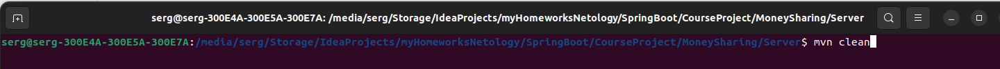
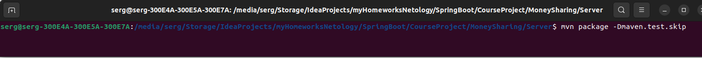
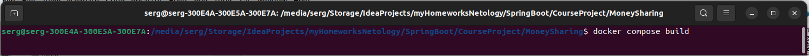
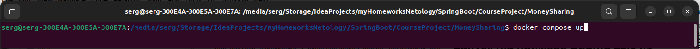
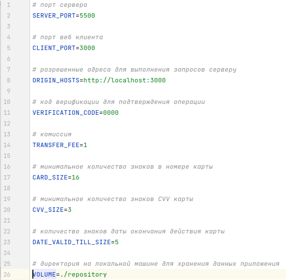
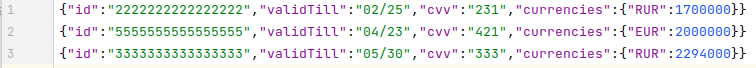
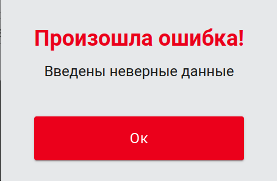
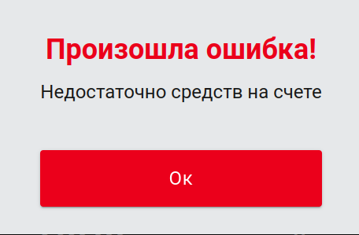
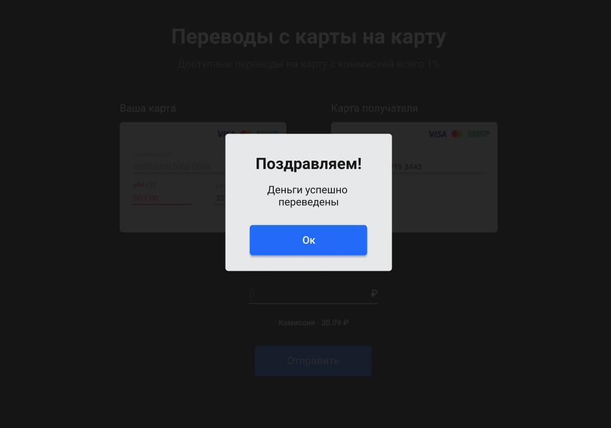

# Переводы с карту на карту

Приложение предоставляет простой сервис перевода денег с карты на карту.

## Запуск (на примере Ubuntu 22.04.1 LTS)

Для запуска приложения с использованием Docker необходимо:

1. склонировать репозиторий,
2. в директории модуля `Server` выролнить команды `mvn clean`

3. затем по очереди `mvn package -Dmaven.test.skip`,

4. `docker compose build`.

После завершения монтирования образов, запуск приложения осуществляется командой `docker compose up`.

Проект будет доступен из браузера по ссылке `http://localhost:3000/`.

В файле `.env` содержатся доступные настройки:

Данные о картах хранятся в файле `cards.json`.
Каждая строка содержит строго 1 карту в формате json:

При отсутствии доступных карт приложение запустится, но любая попытка перевода будет безуспешной.

Логгирование работы сервиса выполняется в файл `log.txt`.

Место хранения файлов приложения на локальной машине может быть изменено в файле настроек `.env`.

## Описание

Проект состоит из веб интерфейса и сервера для перевода денег с карты на карту.

Описание веб интерфейса можно посмотреть [по ссылке](./WebClient/card-transfer-master/README.md).

Сервер обрабатывает запросы от клиента, выполненные в соответствии с протоколом
[https://github.com/netology-code/jd-homeworks/blob/master/diploma/MoneyTransferServiceSpecification.yaml](https://github.com/netology-code/jd-homeworks/blob/master/diploma/MoneyTransferServiceSpecification.yaml)
.
Проверяются валидации:

* Номер карты - обязательное, минимум 16 знаков
* ММ/ГГ - обязательное, минимум 5 знаков
* CVC - обязательное, минимум 3 знака
* Сумма перевода - обязательное, не может быть равное или меньше 0
* Номер карты отправителя и карты получателя не должны совпадать
* У карты получателя должен быть счет в валюте перевода
* На счете отправителя достаточно средств для выполения операции

## Обработка запросов

Эндпоинты:

* `/transfer` - принимает объект и возвращает номер операции при успешном выполнении
* `/confirmOperation` - принимает объект с кодом верификации и возвращает номер операции при успешном выполнении

Если какой-либо из указанных валидаций не соблюдается, то выбрасывается исключение и клиенту возвращается ответ с
ошибкой:

 

При успешном завершении, отображается соответствующее модальное окно и поля формы очищаются.

